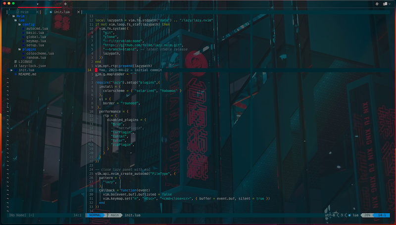
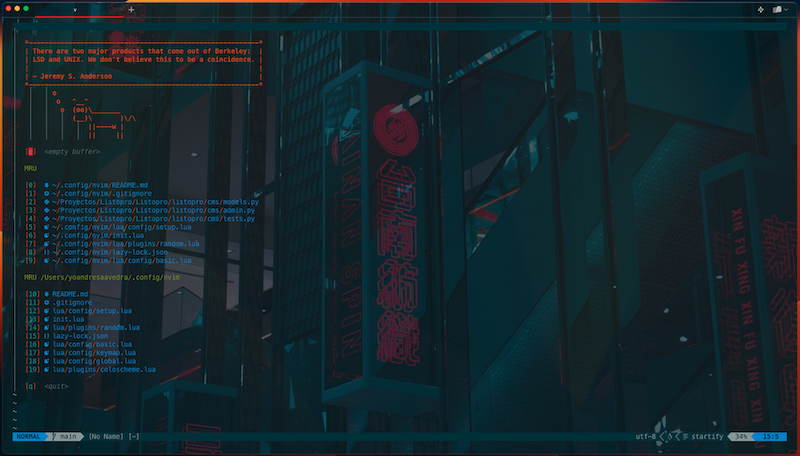

## Hi is Yoandre here!
This is my config migrated from init.vim to init.lua using lazy.vim for packages management.

## Plugins
- A universal set of defaults that (hopefully) everyone can agree on. [Sensible](https://github.com/tpope/vim-sensible)
- A blazing fast and easy to configure Neovim statusline written in Lua [lualine](https://github.com/nvim-lualine/lualine.nvim)
- Language support and autocompletion LSP [COC](https://github.com/neoclide/coc.nvim)
- File Manager for Neovim [CHADTree](https://github.com/ms-jpq/chadtree)
- File Manager using Oil
- Start screen, the fancy start screen for vim [Startify](https://github.com/mhinz/vim-startify)
- Command-line fuzzy finder [FZF](https://github.com/junegunn/fzf.vim)

## Installation
You need have installed neovim-8 at least.
Clone repo in .config

The final route shoud be somethin like ~/.config/nvim/

# vim-lua-2023
Migrating from init.vim to init.lua in 2023

I was trying to migrate from init.vim to init.lua. There are many guides to make this easier. 

